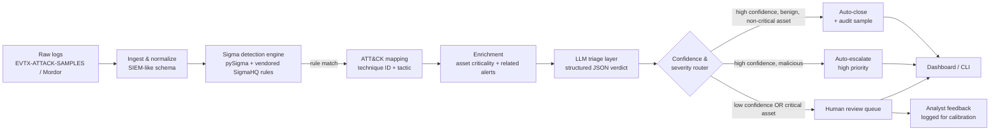

# LLM-Assisted SOC Alert Triage Pipeline (Sigma + MITRE ATT&CK)

> A detection-to-triage pipeline that runs public Sigma rules against real attack-simulation log data, maps every match to MITRE ATT&CK, and uses an LLM to produce a structured, confidence-scored triage verdict with human-in-the-loop escalation for anything the model isn't sure about.

[Demo video (3 min)](#) · [Live dashboard](#) · [Evaluation results](docs/EVALUATION.md) · [Design decisions](docs/DESIGN_DECISIONS.md)


---

## Problem statement

SOC analysts triage far more alerts than they can meaningfully review — most SIEM deployments produce a high false-positive rate, and Tier-1 analysts spend the majority of their time on alerts that turn out to be benign. The cost of *missing* a true positive on a critical asset, however, is far higher than the cost of an analyst spending a few extra minutes on a false alarm.

This project builds a pipeline that:
1. Detects suspicious activity in real attack-simulation logs using **actual, publicly maintained Sigma detection rules** (not hand-labeled ground truth).
2. Maps every detection to its **MITRE ATT&CK technique**, so an analyst immediately knows *what kind of behavior* triggered it.
3. Uses an LLM to produce a **structured, explainable triage verdict** (verdict, confidence, reasoning, recommended action) using the same context an analyst would use — asset criticality and recent related activity.
4. Routes low-confidence or high-stakes verdicts to a **human review queue** rather than ever silently auto-suppressing them — the core design decision of the project.
5. Is evaluated against a manually labeled test set with **honest metrics**, including false-negative rate specifically on high/critical-severity alerts, not just aggregate accuracy.

The goal isn't "an LLM that auto-closes alerts." It's a triage *assistant* that reduces analyst workload on clearly benign activity while remaining conservative — provably, measurably conservative — about anything ambiguous or high-stakes.

---

## Architecture



*(Rendered natively by GitHub. PNG export at `docs/architecture.png` for anywhere Mermaid isn't supported.)*

---

## Data sources

| Source | What it provides | Why this instead of Kaggle |
|---|---|---|
| [EVTX-ATTACK-SAMPLES](https://github.com/sbousseaden/EVTX-ATTACK-SAMPLES) | Real Windows EVTX exports from simulated attacks, per-technique | Practitioner-maintained, used in real DFIR training |
| [OTRF Security-Datasets (Mordor)](https://github.com/OTRF/Security-Datasets) | ATT&CK-tagged attack simulation datasets with metadata | Ground-truth technique labels ship with the data itself |
| [SigmaHQ/sigma](https://github.com/SigmaHQ/sigma) | The detection rules themselves | The actual open-source ruleset used by real SOCs/SIEMs |
| [MITRE ATT&CK](https://github.com/mitre-attack/attack-stix-data) | Technique/tactic metadata | Canonical source for technique names and descriptions |

Datasets used in this project: `[list the 5–10 you picked, with ATT&CK tactics covered]`.
Sigma rule subset: `[N] rules`, vendored at commit `[hash]` from `rules/windows/...`.

---

## AI technique used

- **Model**: `[e.g. claude-sonnet-4-6 via the Anthropic Messages API]`
- **Technique**: prompt-based structured triage with a fixed JSON output schema (tool-based structured output where available), not fine-tuning — each alert is triaged independently with explicit context (alert fields, ATT&CK mapping, asset criticality, related recent activity) rather than relying on the model's parametric knowledge alone.
- **Guardrails**: alert field values are explicitly framed as untrusted data in the system prompt, and the pipeline is tested against a synthetic prompt-injection payload embedded in a log field (see `tests/test_prompt_injection.py` and `docs/EVALUATION.md#prompt-injection-test`).
- **Cost/latency**: `[$X total / $Y per alert, Z seconds average]` for `[N]` alerts, benchmarked in `docs/EVALUATION.md`.

---

## Sample input → output

**Alert in:**
```json
{
  "rule.name": "Suspicious PowerShell Encoded Command",
  "rule.id": "...",
  "severity": "high",
  "attack": {"technique_id": "T1059.001", "technique_name": "PowerShell", "tactic": "Execution"},
  "host.name": "WIN-DC01",
  "host.criticality": "critical",
  "user.name": "svc_backup",
  "process.command_line": "powershell -enc SQBFAFgA...",
  "related_alerts_24h": ["T1003.001 on same host 40 minutes earlier"]
}
```

**LLM triage verdict out:**
```json
{
  "verdict": "true_positive",
  "confidence": 0.91,
  "reasoning": "Encoded PowerShell execution on a domain controller by a service account, occurring shortly after a credential-access alert on the same host, matches a common post-exploitation pattern rather than routine admin activity.",
  "recommended_action": "isolate_host",
  "attack_technique_referenced": "T1059.001"
}
```

**Routing decision:** critical asset → routed to human review regardless of confidence, flagged high-priority given the true_positive verdict and correlated prior alert.

More examples (including a false-positive case and the prompt-injection test case) in `data/llm_traces/`.

---

## Escalation logic

The single most important design decision in this project: **the LLM can recommend, but it never has unilateral authority to suppress an alert.**

| Confidence | Verdict | Asset criticality | Action |
|---|---|---|---|
| ≥ `[0.85]` | false_positive | non-critical | Auto-close (5% randomly re-surfaced for audit) |
| ≥ `[0.85]` | true_positive | any | Auto-escalate, high priority |
| any | any | **critical** | Always routed to human review, regardless of confidence |
| < `[0.85]` | any | any | Routed to human review |

Thresholds are stricter for higher-severity Sigma rules — see `docs/DESIGN_DECISIONS.md` for the exact per-severity threshold table and reasoning.

---

## Evaluation results

Full methodology in [`docs/EVALUATION.md`](docs/EVALUATION.md). Headline numbers:

| Metric | Overall | High/Critical severity only |
|---|---|---|
| Precision | `[x]` | `[x]` |
| Recall | `[x]` | `[x]` |
| **False negative rate** | `[x]` | **`[x]`** |
| vs. naive baseline (escalate all high/critical, close rest) | `[+/- x pts recall, +/- x pts analyst workload]` | |

**Tradeoff note:** this system is deliberately tuned to optimize recall on high/critical-severity alerts, even at the cost of a higher false-positive (over-escalation) rate, because a missed detection on a critical asset is a categorically more expensive error than an analyst reviewing an extra benign alert. See `docs/EVALUATION.md` for the full calibration analysis and where the LLM layer did/didn't outperform the naive baseline.

---

## Dashboard / CLI

`[screenshot of the Streamlit dashboard or CLI table here]`

Run it locally:
```bash
streamlit run dashboard/app.py
```

---

## Running the pipeline

```bash
python -m venv .venv && source .venv/bin/activate
pip install -r requirements.txt

# 1. normalize sample logs
python src/ingest.py --input data/raw --output data/normalized.jsonl

# 2. run Sigma detection
python src/detect.py --logs data/normalized.jsonl --rules data/sigma_rules --output data/alerts.jsonl

# 3. run full triage pipeline (ATT&CK mapping + enrichment + LLM + escalation)
python src/pipeline.py --alerts data/alerts.jsonl --output data/triaged.jsonl

# 4. view results
streamlit run dashboard/app.py
```

Or with Docker:
```bash
docker build -t soc-llm-triage .
docker run -p 8501:8501 soc-llm-triage
```

---

## Limitations & what I'd do differently at scale

- Evaluation set is manually labeled and relatively small (`[N]` alerts) — precision/recall estimates have wide confidence intervals; would want a larger, ideally multi-annotator labeled set for production-grade numbers.
- Related-alert correlation is a simple time-windowed lookback; at scale this would be a vector-similarity or graph-based correlation over a proper alert store rather than an in-memory groupby.
- Batch, not streaming — a production version would ingest from a real SIEM/EDR stream rather than static log files.
- Single-model evaluation by default; `[if you did the model comparison]` a second model was compared on a subset — see `docs/EVALUATION.md`.
- Asset criticality is a small simulated inventory, not a real CMDB integration.

---

## Repo structure

See [`docs/BUILD_GUIDE.md`](docs/BUILD_GUIDE.md) for the full build walkthrough and design rationale, and [`docs/DESIGN_DECISIONS.md`](docs/DESIGN_DECISIONS.md) for a list of non-obvious choices and the alternatives considered for each.

---

## Author's note

Written up in more detail here: `[link to your retrospective blog post / LinkedIn post]`. Happy to walk through the prompt design, the escalation logic, or the prompt-injection test live — that's the fastest way to see it's real.